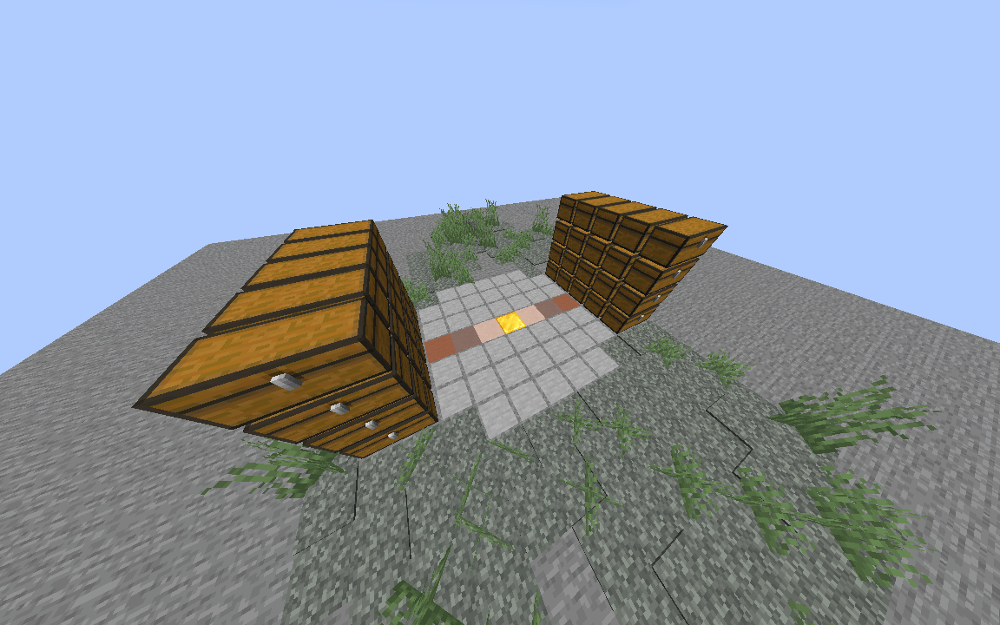

# 📦 AutoChest-Minescript

**MineSorter** est un ensemble de scripts Python pour [Minescript](https://minescript.net/) permettant d'automatiser entièrement le rangement de vos coffres dans Minecraft en créant des îlots de stockage *intelligents*.

---

## 🛠️ Installation

1. Assurez-vous d'avoir installez le mod **Minescript** sur votre instance de Minecraft.
2. Téléchargez ce dépôt et placez l'ensemble des fichiers du dossier **minescript** dans le dossier **exec** des scrips du mod :
   * Le chemin depuis votre instance devrait être : */.minecraft/minescript/system/exec*
3. Lancez votre jeu Minecraft.

> Mes tests ont eu lieu sur la version 26.2 (fabric)

---

## 🏝️ Création de la Salle des Coffres (SdC)

Premièrement, rendez-vous en jeu. À vous de concevoir votre salle des coffres comme bon vous semble, du moment **qu'elle valide ces quelques critères** :

* Les différents coffres sont rangés par **îlot** (cf. image ci-dessous). Un îlot est un ensemble de **40 doubles coffres** (20 vers l'Est, et 20 autres vers l'Ouest). Chacun des deux côtés de l'îlot possède **4 rangées de 5 coffres**, d'où le repérage des coffres par le triplet (*îlot*, *ligne*, *colonne*).

> Si un coffre est vers l'Est (resp. vers l'Ouest), il aura pour valeur de ligne **1** (resp. **5**) s'il est placé sur la rangée du haut, et **4** (resp. **8**) sur la rangée du bas.

* Les centres des différents îlots doivent être distants de **30 blocs au maximum** les uns des autres.
* **Tous** les îlots doivent se trouver sur la **même coordonnée Y** (la SdC doit, plus généralement, se situer exclusivement à une unique altitude).

### Schéma d'un Îlot de Stockage

⚠️ **Note :** L'image ci-dessous est un schéma explicatif de la façon dont le script perçoit votre construction. À vous de choisir la base de l'îlot, le bloc central, etc. Veillez à orienter les deux côtés avec les coffres à l'**Est** et à l'**Ouest**, et veillez à ce que l'îlot ne soit pas encombré.

> Un schématique est disponible également pour vous aider à concevoir vos îlots

**Explications** :

* **Point de Référence Central (Centre de l'îlot) :** C'est le bloc (ici, un bloc d'or) qui sert d'ancrage pour définir l'îlot entier via la commande `/set {numéro de l'îlot}`.
* **Piles de Stockage (Double Coffres) :** Les coffres sont regroupés par piles. Chacun d'entre eux est assigné à un identifiant (*îlot*, *ligne*, *colonne*).

### Compléter la SdC

À présent, vous devez informer le script de la configuration de votre SdC.

1. Définissez vos îlots en vous plaçant sur un des blocs centrals et utilisez la commande en jeu **`\set {numéro de l'îlot}`**

> Un fichier `.json` nommé **`SdC.json`** sera créé à la racine de votre instance dès que vous commencerez à définir vos îlots. C'est dans ce fichier que seront enregistrés vos différents items, associés au triplet du coffre correspondant défini plus tôt.

2. Enregistrez un item en le prenant en main, puis en exécutant en jeu **`\addTo {numéro de l'îlot} {numéro de la ligne} {numéro de la colonne}`**.

> C'est probablement l'étape la plus longue. Si vous le souhaitez, vous pouvez déplacer à la racine de votre instance le fichier `SdC.json` situé dans le dossier `biblio` du dépôt. Il s'agit de mon propre template de salle des coffres pré-rempli héhé :)

Si vous vous demandez où est rangé un item spécifique, prenez-le en main et exécutez la commande **`\getInfo`** en jeu.

---

## 🎮 Utilisation

À présent, vous pouvez faire la commande en jeu **\sort** qui se charge de ranger automatiquement les items dans votre inventaire (non-hotbar).

⚠️ **Attention** : Lors de l'exécution du tri (`sort`), le script prend temporairement le contrôle des mouvements et actions de votre joueur. N'utilisez pas votre clavier/souris pendant le processus.

### Détail des commandes disponibles

* `\set {numéro îlot}` : Définit ou réinitialise un coffre ou une zone d'îlot.
* `\addTo {numéro de l'îlot} {numéro de ligne} {numéro de colonne}` : Ajoute l'item en main au coffre ciblé.
* `\sort` : Lance la routine de rangement automatique. Le joueur se déplace vers les coffres correspondants et dépose les objets de son inventaire.
* `\getInfo` : Affiche les informations relatives à l'item en main, s'il est ou non déjà dans la SdC.

## 🎬 Démonstration

Cliquez sur l'image ci-dessous pour voir le script en action :

